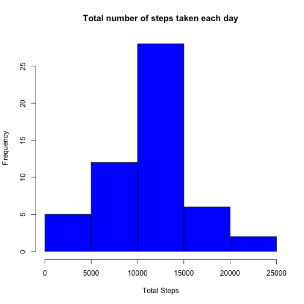
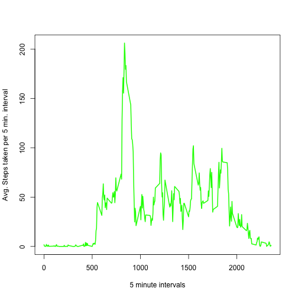
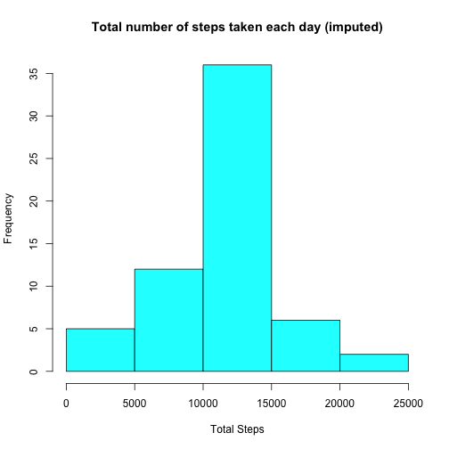
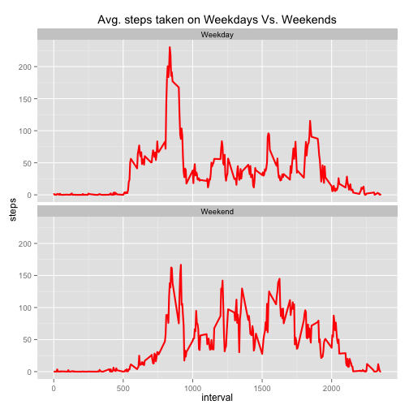

<B> <U> Section 1: Loading and preprocessing the data </U> </B>


```r
fileUrl <- "https://d396qusza40orc.cloudfront.net/repdata%2Fdata%2Factivity.zip"
download.file(fileUrl, destfile = "activity_monitor.zip", method = "curl")
unzip("activity_monitor.zip")

activity_data <- read.csv("activity.csv")
clean_activity <- na.omit(activity_data)
```

<B> 1. What is mean total number of steps taken per day? </B>


```r
tot_act<-ddply(clean_activity,.(date),summarize,tot_steps=sum(steps))

# Here is a sample of total steps taken per day
head(tot_act)
```

```
##         date tot_steps
## 1 2012-10-02       126
## 2 2012-10-03     11352
## 3 2012-10-04     12116
## 4 2012-10-05     13294
## 5 2012-10-06     15420
## 6 2012-10-07     11015
```

<B> 2. Make a histogram of the total number of steps taken each day </B>

```r
hist(tot_act$tot_steps, col="Blue", main = "Total number of steps taken each day", xlab="Total Steps")
```

 


<B> 3. Mean and median of the total number of steps taken per day </B>

```r
mean_tot_steps <- round(mean(tot_act$tot_steps))
# Mean Total Steps
mean_tot_steps
```

```
## [1] 10766
```

```r
median_tot_steps <- round(median(tot_act$tot_steps))
# Median Total Steps
median_tot_steps
```

```
## [1] 10765
```

```r
# The Summary function can also provide the Mean and Median along with other statistics
summary(tot_act)
```

```
##          date      tot_steps    
##  2012-10-02: 1   Min.   :   41  
##  2012-10-03: 1   1st Qu.: 8841  
##  2012-10-04: 1   Median :10765  
##  2012-10-05: 1   Mean   :10766  
##  2012-10-06: 1   3rd Qu.:13294  
##  2012-10-07: 1   Max.   :21194  
##  (Other)   :47
```

<B> What is the average daily activity pattern? </B>


```r
# 1. Make a time series plot (i.e. type = "l") of the 5-minute interval (x-axis) and the average number of steps taken, averaged across all days (y-axis)

avg_act<-ddply(clean_activity,.(interval),summarize,avg_steps=mean(steps))

plot(avg_act$interval, avg_act$avg_steps, type="l", xlab= "5 minute intervals", ylab= "Avg. Steps taken per 5 min. interval", col="green" , lwd=2)
```

 

<B> 2. Which 5-minute interval, on average across all the days in the dataset, contains the maximum number of steps? </B>

```r
sqldf('select interval, max(avg_steps) "Max Steps" from avg_act ' ) 
```

```
##   interval Max Steps
## 1      835  206.1698
```
Interval <B> 835</B> contains the maximum number of steps (ie) <B> 206.1698 </B>

<B> Imputing missing values </B>


```r
# 1. Calculate and report the total number of missing values in the dataset (i.e. the total number of rows with NAs)

# Method 1 - Use SQL 
sqldf('select count(*) from activity_data where steps is null')
```

```
##   count(*)
## 1     2304
```

```r
# Method 2 - Use sum function 
sum(is.na(activity_data$steps))
```

```
## [1] 2304
```
There are <B> 2304 </B> missing values in the dataset.


```r
# 2. Devise a strategy for filling in all of the missing values in the dataset. The strategy does not need to be sophisticated. 
# For example, you could use the mean/median for that day, or the mean for that 5-minute interval, etc.


imp_mean <- function(col) replace(col, is.na(col), mean(col, na.rm = TRUE))
act_data_imputed <- ddply(activity_data, .(interval), transform, steps = round(imp_mean(steps)))
act_data_imputed <- act_data_imputed[order(act_data_imputed$date), ]

head(act_data_imputed)
```

```
##     steps       date interval
## 1       2 2012-10-01        0
## 62      0 2012-10-01        5
## 123     0 2012-10-01       10
## 184     0 2012-10-01       15
## 245     0 2012-10-01       20
## 306     2 2012-10-01       25
```

```r
# 3. Create a new dataset that is equal to the original dataset but with the missing data filled in.
tot_act_imputed<-ddply(act_data_imputed,.(date),summarize,tot_steps=sum(steps))

head(tot_act_imputed)
```

```
##         date tot_steps
## 1 2012-10-01     10762
## 2 2012-10-02       126
## 3 2012-10-03     11352
## 4 2012-10-04     12116
## 5 2012-10-05     13294
## 6 2012-10-06     15420
```

```r
#4. Make a histogram of the total number of steps taken each day and Calculate and report the mean and median total number of steps taken per day.
hist(tot_act_imputed$tot_steps, col="Cyan", main = "Total number of steps taken each day (imputed)", xlab="Total Steps")
```

 

The distribution appears to be the same after filling in the missing data.


```r
# Reporting the Mean and Median of the imputed values:

# Mean imputed
mean_tot_steps_imp <- round(mean(tot_act_imputed$tot_steps))
mean_tot_steps_imp
```

```
## [1] 10766
```

```r
# Median imputed
median_tot_steps_imp <- round(median(tot_act_imputed$tot_steps))
median_tot_steps_imp
```

```
## [1] 10762
```

<B> Are there differences in activity patterns between weekdays and weekends? </B>


```r
# 1. Create a new factor variable in the dataset with two levels – “weekday” and “weekend” indicating whether a given date is a weekday or weekend day.

# Convert date to POSIXct class. date column in the activity_data dataset is a Factor with 61 levels. 
# This needs to be converted to date in order to use the weekdays() function.
act_data_imputed$day_of_week <- as.factor(weekdays(as.Date(strptime(act_data_imputed$date, "%Y-%m-%d"))))

x<-c("Monday","Tuesday","Wednesday", "Thursday", "Friday")
y<-c("Weekday")
a<-c("Saturday","Sunday")
b<-c("Weekend")

act_data_imputed$day_of_week <- mgsub(x,y,act_data_imputed$day_of_week)
act_data_imputed$day_of_week <- mgsub(a,b,act_data_imputed$day_of_week)

act_data_imputed$day_of_week <- as.factor(act_data_imputed$day_of_week)

head(act_data_imputed)
```

```
##     steps       date interval day_of_week
## 1       2 2012-10-01        0     Weekday
## 62      0 2012-10-01        5     Weekday
## 123     0 2012-10-01       10     Weekday
## 184     0 2012-10-01       15     Weekday
## 245     0 2012-10-01       20     Weekday
## 306     2 2012-10-01       25     Weekday
```

```r
# 2. Make a panel plot containing a time series plot (i.e. type = "l") of the 5-minute interval (x-axis) and the average number of steps taken, averaged across all weekday days or weekend days (y-axis). 

data_time_plot <- aggregate(act_data_imputed$steps, list(interval = act_data_imputed$interval, dow = act_data_imputed$day_of_week), mean)
names(data_time_plot) <- c("interval", "DOW", "steps")

## Plot using ggplot2
ggplot(data_time_plot, aes(interval, steps)) + geom_line(color = "Red", lwd = 1) + facet_wrap(~DOW, ncol = 1) + labs(title = expression("Avg. steps taken on Weekdays Vs. Weekends"))
```

 

From the above panel plots, it appears that there is more activity over the weekend than on weekdays.
